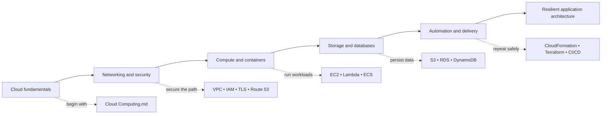

# AWS Learning Vault

> A practical, beginner-friendly knowledge base for learning how modern applications travel from a browser request to resilient workloads on AWS.

This repository is deliberately lightweight: every lesson is a readable Markdown note, so you can browse it on GitHub, clone it, or use it as a focused interview-prep checklist. The topic notes now pair explanations with memorable mental models and recall questions; the console field guides turn those concepts into ordered hands-on workflows with verification and cleanup steps. The animated header is a small visual welcome; the learning material itself remains useful even when external images are blocked.

## ✨ At a glance

| 34 | 18 | 16 | 133 |
|:--:|:--:|:--:|:--:|
| focused study notes | AWS-first notes | cloud, web, DevOps, and architecture notes | topics in the flagship cloud guide |

## 🧭 Start here

| If you want to… | Open this first | Then continue with |
| --- | --- | --- |
| Understand cloud vocabulary and interview fundamentals | [Cloud Computing.md](./Cloud%20Computing.md) | [AWS.md](./AWS.md) → [AWS VPC.md](./AWS%20VPC.md) |
| Build a reliable web application on AWS | [AWS VPC.md](./AWS%20VPC.md) | [AWS EC2.md](./AWS%20EC2.md) → [AWS ELB.md](./AWS%20ELB.md) → [AWS RDS.md](./AWS%20RDS.md) |
| Learn a request's journey across the web | [HTTP.md](./HTTP.md) | [API.md](./API.md) → [Amazon Route 53.md](./Amazon%20Route%2053.md) → [AWS CloudFront CDN.md](./AWS%20CloudFront%20CDN.md) |
| Move toward DevOps and platform work | [DOCKER.md](./DOCKER.md) | [KUBERNETES.md](./KUBERNETES.md) → [Aws Terraform.md](./Aws%20Terraform.md) → [CI CD pipeline.md](./CI%20CD%20pipeline.md) |

## 🗺️ Learning paths

### 1. The AWS core path

Build a solid mental model before memorising individual services:

1. [Cloud Computing.md](./Cloud%20Computing.md) — cloud models, regions, availability, cost, security, architecture, migration, observability, and interview scenarios.
2. [AWS.md](./AWS.md) — a short AWS orientation and IAM introduction.
3. [AWS IAM.md](./AWS%20IAM.md) + [AWS VPC.md](./AWS%20VPC.md) — identity, permissions, network boundaries, and traffic controls.
4. [AWS EC2.md](./AWS%20EC2.md) + [AWS ELB.md](./AWS%20ELB.md) — compute, load balancing, and elastic capacity.
5. [AWS S3.md](./AWS%20S3.md) + [AWS RDS.md](./AWS%20RDS.md) + [AWS DynamoDB.md](./AWS%20DynamoDB.md) — choose the right data layer.

### 2. The web-request path

Follow one request from a human-readable URL to an application response:

`Browser` → [DNS / Route 53](./Amazon%20Route%2053.md) → [CDN / CloudFront](./AWS%20CloudFront%20CDN.md) → [Load balancer](./AWS%20ELB.md) → [EC2](./AWS%20EC2.md), [ECS](./AWS%20ECS.md), or [Lambda](./AWS%20Lambda.md) → [RDS](./AWS%20RDS.md), [DynamoDB](./AWS%20DynamoDB.md), or [S3](./AWS%20S3.md)

Pair it with [HTTP.md](./HTTP.md), [API.md](./API.md), and [AWS SSL-TLS.md](./AWS%20SSL-TLS.md) to understand the protocol, application interface, and encrypted connection behind that flow.

### 3. The cloud-native path

[Monolithic and Microservices archit.md](./Monolithic%20and%20Microservices%20archit.md) → [DOCKER.md](./DOCKER.md) → [KUBERNETES.md](./KUBERNETES.md) → [AWS ECS.md](./AWS%20ECS.md) → [AWS Lambda.md](./AWS%20Lambda.md)

This route moves from application boundaries to containers, orchestration, managed container workloads, and event-driven serverless design.

### 4. The delivery and automation path

[AWS CloudFormation IAC.md](./AWS%20CloudFormation%20IAC.md) → [Aws Terraform.md](./Aws%20Terraform.md) → [CI CD pipeline.md](./CI%20CD%20pipeline.md)

Learn why infrastructure should be repeatable, versioned, and delivered through automated feedback loops instead of hand-built consoles.

## 📚 Explore every note

### Cloud foundations, web, and security

| Note | What you will learn |
| --- | --- |
| [Cloud Computing.md](./Cloud%20Computing.md) | The flagship 133-topic cloud guide: service and deployment models, regions/AZs, pricing, scaling, resiliency, security, migration, observability, release strategies, architecture patterns, and interview prompts. |
| [AWS.md](./AWS.md) | A concise AWS overview covering its core value proposition—scalability, global reach, reliability, security, and pay-as-you-go economics—plus an IAM primer. |
| [VIRTUALIZATION.md](./VIRTUALIZATION.md) | Virtual machines, hypervisors, Type 1 vs. Type 2 virtualization, isolation, snapshots, and why virtualized infrastructure matters. |
| [Web Architectures.md](./Web%20Architectures.md) | One-tier through N-tier applications, static vs. dynamic sites, request/response flow, and the purpose of layered architecture. |
| [Client-side and Server-side.md](./Client-side%20and%20Server-side.md) | The division between browser execution and server execution, including their roles, dependencies, and platform-independence benefits. |
| [HTTP.md](./HTTP.md) | HTTP fundamentals: client-server communication, statelessness, URL parts, request/response anatomy, headers, bodies, and status codes. |
| [API.md](./API.md) | APIs as the bridge between systems, with REST, SOAP, GraphQL, and the essential GET, POST, PUT, and DELETE methods. |
| [AWS SSL-TLS.md](./AWS%20SSL-TLS.md) | Confidentiality, integrity, and authentication; symmetric/asymmetric and hybrid encryption; hashing, MACs, certificates, formats, and the TLS handshake. |

### Networking, edge, and traffic

| Note | What you will learn |
| --- | --- |
| [Amazon Route 53.md](./Amazon%20Route%2053.md) | DNS foundations, domain registration, hosted zones, common record types, routing policies, and health checks. |
| [AWS VPC.md](./AWS%20VPC.md) | VPC CIDR planning, public/private subnets, route tables, internet and NAT gateways, security groups, NACLs, peering, endpoints, bastions, flow logs, Direct Connect, and Client VPN. |
| [AWS CloudFront CDN.md](./AWS%20CloudFront%20CDN.md) | Global content delivery, edge caching, static vs. dynamic content, cache behavior, TTLs, and how browser caching complements a CDN. |
| [AWS ELB.md](./AWS%20ELB.md) | Vertical vs. horizontal scaling, availability, ALB/NLB/Gateway Load Balancer, target health, and Auto Scaling Group setup and behavior. |
| [PROXY AND REVERSE PROXY.md](./PROXY%20AND%20REVERSE%20PROXY.md) | How forward and reverse proxies differ, plus their privacy, filtering, logging, caching, security, and traffic-management roles. |
| [NGINX.md](./NGINX.md) | Nginx as a high-performance web server, reverse proxy, load balancer, TLS termination point, and compression layer. |

### Compute and containers

| Note | What you will learn |
| --- | --- |
| [AWS EC2.md](./AWS%20EC2.md) | EC2 instance fundamentals, instance types, AMIs, EBS, security groups, key pairs, network settings, IAM roles, user data, and Elastic IPs. |
| [AWS AMI.md](./AWS%20AMI.md) | AMIs as repeatable EC2 templates, public/private/Marketplace image types, and an example cleanup-script workflow. |
| [AWS EBS.md](./AWS%20EBS.md) | Persistent, AZ-scoped block storage for EC2; durability, volume considerations, and database-oriented storage use cases. |
| [AWS Lambda.md](./AWS%20Lambda.md) | Event-driven serverless compute, AWS triggers, billing model, execution limits, statelessness, cold starts, and common automation use cases. |
| [AWS ECS.md](./AWS%20ECS.md) | Managed container workloads through ECS clusters, services, tasks, scaling, and load-balancing concepts. |
| [DOCKER.md](./DOCKER.md) | Containers and their portability, the image-vs.-container distinction, lightweight packaging, and core Docker vocabulary. |
| [KUBERNETES.md](./KUBERNETES.md) | Why container orchestration exists and how Kubernetes supports availability, scalability, and recovery for containerized applications. |

### Storage and databases

| Note | What you will learn |
| --- | --- |
| [AWS S3.md](./AWS%20S3.md) | Object storage, buckets and keys, object limits, multipart upload, static-site hosting, versioning, replication, encryption, policies, storage classes, and hybrid storage services. |
| [AWS RDS.md](./AWS%20RDS.md) | Managed relational databases, MySQL deployment concepts, Aurora, backups, Multi-AZ, read replicas, patching, storage scaling, monitoring, network isolation, and application use cases. |
| [AWS DynamoDB.md](./AWS%20DynamoDB.md) | Managed NoSQL key-value/document storage, items and tables, performance, on-demand capacity, scaling, availability, and a contacts-table example. |

### Infrastructure, delivery, and application design

| Note | What you will learn |
| --- | --- |
| [AWS CloudFormation IAC.md](./AWS%20CloudFormation%20IAC.md) | AWS-native declarative infrastructure: templates, stacks, S3-hosted templates, repeatability, and automated provisioning. |
| [Aws Terraform.md](./Aws%20Terraform.md) | Multi-cloud IaC with HCL/JSON, the `init` → `plan` → `apply` lifecycle, state, remote collaboration, `count`, `for_each`, and reusable modules. |
| [CI CD pipeline.md](./CI%20CD%20pipeline.md) | CI/CD concepts, SDLC stages, continuous delivery vs. deployment, automation benefits, and common manual-release bottlenecks. |
| [CICD.md](./CICD.md) | A focused CI/CD explanation covering the software lifecycle, integration, delivery, deployment, and release automation. |
| [JENKINS.md](./JENKINS.md) | A title-only placeholder reserved for a future Jenkins-focused automation and pipeline guide. |
| [Monolithic and Microservices archit.md](./Monolithic%20and%20Microservices%20archit.md) | The trade-offs between monoliths and microservices: deployment, scaling, coupling, fault isolation, and team autonomy. |
| [MVC.md](./MVC.md) | Model-View-Controller responsibilities, the request flow between layers, and why separation of concerns helps dynamic web applications. |
| [MVP.md](./MVP.md) | Minimum Viable Product thinking, early validation, feedback loops, plus a companion explanation of MVC responsibilities and benefits. |
| [AWS Amplify.md](./AWS%20Amplify.md) | A high-level introduction to Amplify for building, deploying, hosting, and connecting full-stack web or mobile applications. |

## 🎛️ AWS Console Field Guides

The repository includes [36 step-by-step console walkthroughs](./aws-console/README.md), with setup, verification, security choices, and cleanup notes for the AWS services covered here. Start with the [guide index](./aws-console/README.md), or jump directly to [S3](./aws-console/amazon-s3.md), [RDS](./aws-console/amazon-rds.md), [VPC and networking](./aws-console/amazon-vpc-networking.md), [EC2](./aws-console/amazon-ec2.md), [IAM](./aws-console/iam.md), or [Lambda](./aws-console/aws-lambda.md).

## 🧠 A quick service chooser

| Need | Start with | Why |
| --- | --- | --- |
| A virtual server you control | [EC2](./AWS%20EC2.md) | Flexible compute with OS, instance, storage, network, and access choices. |
| Run code for an event without managing servers | [Lambda](./AWS%20Lambda.md) | Event-driven, automatically scaled serverless execution. |
| Run and manage containers | [ECS](./AWS%20ECS.md) or [Kubernetes](./KUBERNETES.md) | Managed container scheduling and operational patterns. |
| Store objects, assets, backups, or a static site | [S3](./AWS%20S3.md) | Durable, scalable object storage. |
| Store structured relational data | [RDS](./AWS%20RDS.md) | Managed database operations, backups, high availability, and read scaling. |
| Store high-scale key-value or document data | [DynamoDB](./AWS%20DynamoDB.md) | Fully managed NoSQL with low-latency access. |
| Define infrastructure as code | [CloudFormation](./AWS%20CloudFormation%20IAC.md) or [Terraform](./Aws%20Terraform.md) | Repeatable, reviewable, automated environment provisioning. |
| Send traffic safely to an app | [Route 53](./Amazon%20Route%2053.md) + [CloudFront](./AWS%20CloudFront%20CDN.md) + [ELB](./AWS%20ELB.md) | DNS, edge delivery, and resilient traffic distribution. |

## 🔐 Learn securely

Cloud knowledge is most valuable when paired with good security habits. While working through these notes, keep these principles close:

- Prefer IAM roles and least-privilege policies over hard-coded credentials.
- Keep databases in private subnets whenever public access is unnecessary.
- Restrict security-group rules to the smallest practical source and port range.
- Use TLS for data in transit and encryption for data at rest.
- Never commit passwords, API keys, access keys, or production endpoints to a repository.

## 🤝 Make the vault better

Useful contributions include correcting a concept, adding a diagram or hands-on lab, improving grammar, expanding the Jenkins placeholder, or linking related notes. Keep additions approachable: explain the *why*, include an example where it helps, and connect the topic to a real architecture.

If one of these notes makes a cloud concept click, [give the repository a star](https://github.com/HUNTER-X0s/Amazon-Web-Services/stargazers). It helps other learners find the vault—and it is a lovely signal to keep building it. ⭐

Made for curious builders who want to understand the cloud as a connected system.

